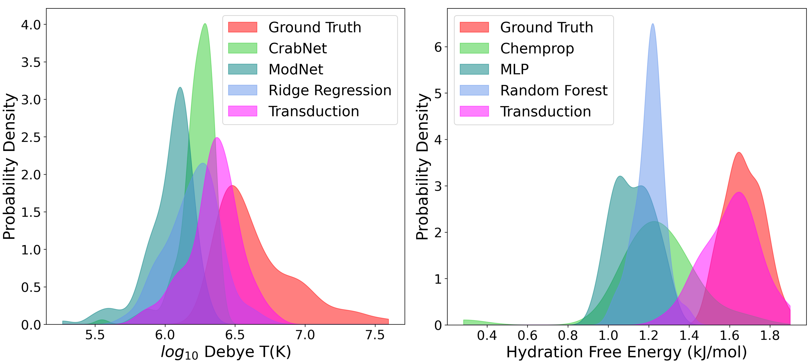

# Known Unknowns: Out-of-Distribution Property Prediction in Materials and Molecules
[//]: # (Badges)
[](https://opensource.org/licenses/MIT)

Code for extrapolation in materials property prediction as proposed in [Known Unknowns: Out-of-Distribution Property Prediction in Materials and Molecules](https://openreview.net/pdf?id=HkfnueE7Ae).



## Setup
Clone the repository
```
git clone https://github.com/learningmatter-mit/matex.git
```
Create and activate a virtual environment
```
conda create -n blt-matex python=3.9.16
conda activate blt-matex
```
Install requirements
```
pip install -r requirements.txt
```
#### Environment Setup
Update hyperparameters in `blt/configs/materials.yml`.
Run the following command where `path_to_dir` is the parent directory of `matex`.
```
export PYTHONPATH="${PYTHONPATH}:path_to_dir"
```


## Data
Run the following script to process the data. Raw data is provided in `blt/data`. Processed data will be saved under `blt/data` as `pkl` files.
```
bash data_modules/create_data.sh
```


## Training and Evaluation
Run the following script to train, evaluate and save the model
```
cd blt
bash train_eval.sh
```

Run the following script to create and save distribution and correlation plots
```
python plot_maker/plots.py
```


## Cite
If you use this code in your research, please consider citing
```
@inproceedings{segal2024known,
  title={Known Unknowns: Out-of-Distribution Property Prediction in Materials and Molecules},
  author={Segal, Nofit and Netanyahu, Aviv and Greenman, Kevin and Agrawal, Pulkit and Gómez-Bombarelli, Rafael},
  booktitle={Workshop on AI for Accelerated Materials Design at Advances in Neural Information Processing Systems},
  year={2024}
}
```


## Acknowledgements
The implementation is derived from [Bilinear Transduction](https://arxiv.org/abs/2304.14329).
The datasets are derived from [AFLOW](https://arxiv.org/abs/1308.5715), [Matbench](https://matbench.materialsproject.org), [Materials Project](www.materialsproject.org), and [MoleculeNet](https://moleculenet.org).
The data processing and feature extraction are derived from [Can machine learning find extraordinary materials?](https://github.com/Kaaiian/can_machine_learning_find_extraordinary_materials), [Modnet](https://github.com/ppdebreuck/modnet) and [Deepchem](https://github.com/deepchem/deepchem).
